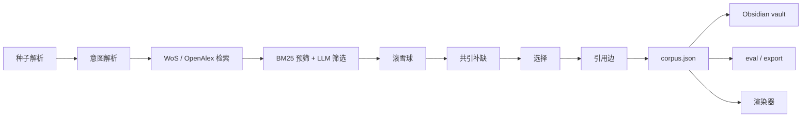

# 测试目录

测试分两层：

- `unit/`：逐个环节检查检索管线，完全离线，CI 每次 push 都会跑。
- `cases/`：真实研究案例。每个案例冻结一套输入和一份基线，离线测试只检查配置和评估逻辑；需要时可以用真实 API 重跑。

```
tests/
├── conftest.py                    共享：FakeLLM、内存引文宇宙、respx 模拟 WoS
├── unit/                          ① 管线各环节（离线）
│   ├── fixtures/                  WoS / OpenAlex 响应样本
│   ├── test_sources.py            检索源：WoS 解析、分页、配额、缓存；OpenAlex；种子识别
│   ├── test_pipeline.py           build 全流程：意图 → 检索式 → 筛选 → 滚雪球 → 补缺 → 选择；档位、年份、分支、Agent
│   ├── test_store_graph.py        去重合并、引用图、BFS/DFS
│   ├── test_export_eval.py        召回评估；BibTeX / RIS / CSV
│   ├── test_obsidian.py           Obsidian vault、Base、Canvas
│   ├── test_renderer.py           开发渲染器 API 与离线资源
│   └── test_network_layout.cjs    渲染器布局（node:test）
├── cases/                         ② 真实研究案例（固定输入 + 基线）
│   ├── classical-garden/          方向 A：当代技术文献检索
│   └── timeline-study/            方向 B：技术史溯源检索
└── SCI/                           classical-garden 的本地 PDF 包（Git 忽略，测试不依赖）
```

## ① 管线与测试的对应



|环节|测试|
|---|---|
|种子、WoS/OpenAlex 客户端、缓存|`unit/test_sources.py`|
|意图到选择的整个 build 流程，以及 Agent|`unit/test_pipeline.py`|
|去重合并、引用边、遍历|`unit/test_store_graph.py`|
|召回评估、导出|`unit/test_export_eval.py`|
|Obsidian 输出|`unit/test_obsidian.py`|
|渲染器与布局|`unit/test_renderer.py`、`unit/test_network_layout.cjs`|

## ② 两个案例

两个案例都走同一条生产管线 `build_corpus`，用固定的 WoS 基础检索式，模型为 deepseek-chat、温度 0.2。区别在于检索方向和评估方式。

||classical-garden|timeline-study|
|---|---|---|
|方向|中国古典园林三维数字化：当代技术文献|景观评价形式化：方法史与模型谱系溯源|
|年份|2018–2025|不设下限（WoS 实际为 1900–2026）|
|分支|1 次运行：3 条基础检索式 + 4 个 WoS 分支|2 次独立运行：history、formal_methods，各 3 条检索式|
|种子|3 篇|3 + 6 篇|
|扩展|一跳双向，上限 200 篇|一跳向后，每分支上限 65 篇|
|评估对象|十篇核对集（`gold.json`），运行后才读取|2026-10-07 基线语料（79 条候选）及其中 20 条直接支持 DOI|
|通过门槛|种子齐全、非种子命中 ≥ 6/7、年份不越界、无重复、引用边有效、检索式一致|种子齐全、检索式一致、无重复；重合率只报告，不作门槛|
|入口|`python -m scripts.real_search`|`python -m scripts.timeline_retrieval`|
|离线测试|`cases/classical-garden/test_classical_garden.py`|`cases/timeline-study/test_timeline_study.py`|

```
cases/classical-garden/                    cases/timeline-study/
├── README.md                              ├── README.md、EVALUATION.md      案例说明与评估问题
├── research_intent.txt   研究意图          ├── SOURCE_MANIFEST.json          原始文件哈希（测试检查）
├── core_literature.txt   种子              ├── input/                        研究快照、时间线数据、DOI 核验
├── case.json             冻结参数与检索式  ├── expected/                     时间线功能重构基线（非检索）
├── gold.json             十篇核对集        ├── replay_baseline.py            时间线重构回放（非检索）
├── baselines.json        历史运行摘要      ├── retrieval/                    ← 检索复现
└── test_classical_garden.py               │   ├── case.json                 两分支冻结参数与检索式
                                           │   ├── baseline/                 原始两份语料 + protocol
                                           │   ├── runs.json                 基线与历次复现摘要
                                           │   └── README.md
                                           └── test_timeline_study.py
```

timeline-study 除 `retrieval/` 和测试文件外，与原案例包逐字节相同，`input/`、`expected/` 中的时间线材料不参与检索测试。

## 命令

```bash
.venv/bin/python -m pytest -q                        # 全部离线测试（unit + 两个案例）
.venv/bin/python -m pytest -q tests/unit             # 只跑管线环节
.venv/bin/python -m pytest -q tests/cases            # 只跑案例
node --test tests/unit/test_network_layout.cjs       # 布局测试，Node 22+

# 真实 API（消耗配额，输出目录必须不存在）
.venv/bin/python -m scripts.real_search plan | run --out corpora/garden-v1-<label> | evaluate <corpus.json> --out <dir>
.venv/bin/python -m scripts.timeline_retrieval plan | run --out corpora/timeline-repro-<label> | compare <dir>
```

真实运行的语料、日志和报告都写在 `../corpora/`，不进 Git。各案例的细节见 [`cases/classical-garden/README.md`](cases/classical-garden/README.md) 和 [`cases/timeline-study/retrieval/README.md`](cases/timeline-study/retrieval/README.md)。
